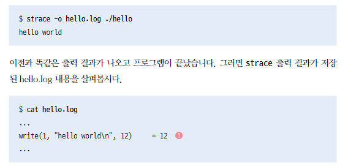
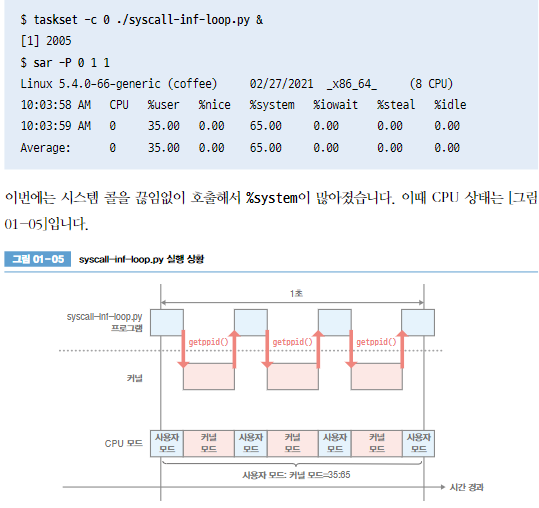
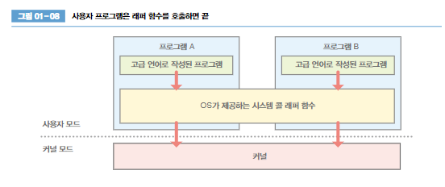
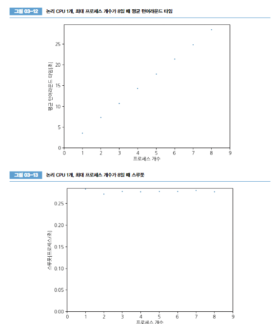
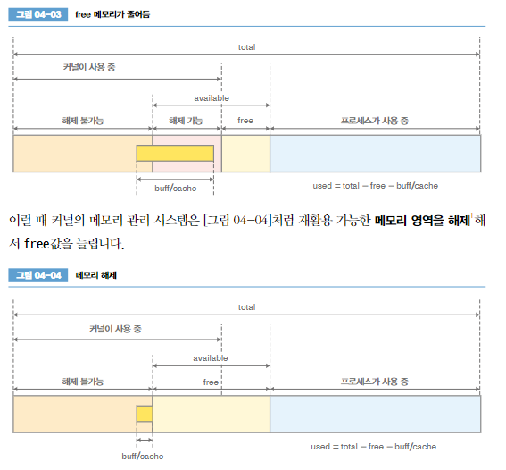
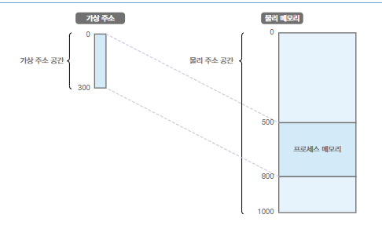
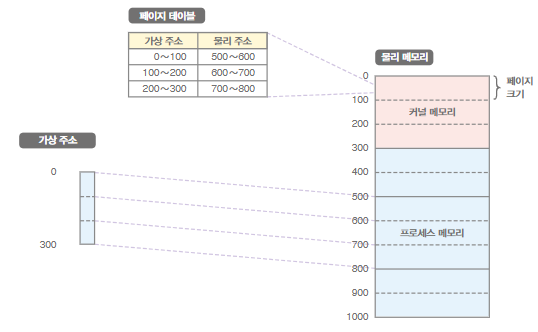
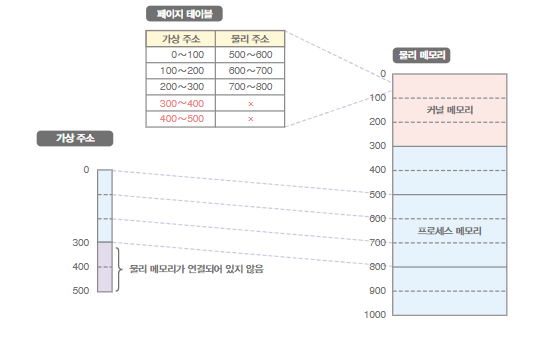
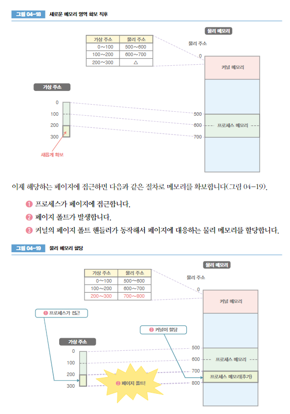

``
# 그림으로 배우는 리눅스 구조

## 커널
- `커널모드`와 `사용자 모드`를 통해 프로세스의 저장 장치 접근을 제한 -- 명령 실행 순서 제어를 위하여
- 사용자 모드에서 실행되는 프로세스는 `사용자 공간`에서 프로세스를 실행
- `커널모드` 로 동작하면 시스템 자원 관리 및 배분 기능을 제공

## 시스템 콜
- 프로세스가 커널에 처리를 요청
    - 프로세스 생성,삭제
    - 메모리 확보,해제
    - 통신 처리
    - 파일 시스템 조작
    - 장치 조작

    - 
- 시스템 콜을 호출하면 예외라는 이벤트 발생
- 사용자 모드에서 커널 모드로 변경

- strace 함수를 이용하여 시스템 콜 내용을 확인 할 수 있다.

- tasket -c 논리cpu번호 명령어
- %system 비율을 통해 cpu모드 시간 존재 확인

- 시스템 콜 소요 시간 확인

## 라이브러리
- C 언어 표준 라이브러리 gilbc 혹은 libc 를 리눅스 에서 활용

### 시스템 콜 래퍼 함수
- getppid() 함수 같이 libc 라이브러리에서 지원

- 콜래퍼 함수 지원으로 호환 문제 없음
- 없다면 각 프로그램에서 어셈블리 언어로 직접 작성하여 시스템 콜 호출 해야함 (아키텍처를 변경 시 동작 보장 못함)

### 정적 라이브러리, 동적(공유) 라이브러리

- 라이브러리 함수를 프로그램에 가져오면 정적
  - 용량이 커짐
- 링크로 이어서 사용한다면 동적
  - 용량이 상대적으로 작다
  - 라이브러리 문제 시 수정된 동적 라이브러리로 교체만 하면 해결 가능

# 프로세스 관리

## 프로세스 생성

### fork()

- fork() 함수 이용
- 부모프로세스는 자신의 프로세스 id 와 자식 프로세스 id를 출력 후 종료, 자식프로세스는 자신 프로레스id 출력 종료

- ret ==0 인 경우는 자식프로세스가 실행, 부모프로세스 id 부르는 함수 getppid() 호출
- ret >0 일 때는 부모프로세스가 실행, ret 에 자식프로세스 id가 저장되어 있다.

### execve()
- execve() 함수 호출한곳의 메모리를 새로운 파일로 대체 하는 함수

#### execve() 실행 시 보유 데이터
- 프로그램 코드와 코드 영역의 파일 오프셋,크기 및 메모리 맵 시작 주소
- 데이터 영역의 파일 오프셋, 크기 및 메모리 맵 시작 주소
- 최초로 실행할 명령의 메모리 주소

- 프로그램의 데이터 저장 위치 및 오프셋등 정보를 확인 가능하다.

### ASLR
- -no-pie 옵션으로 aslr을 통한 프로그램 실행할 때마다 각 섹션을 다른 주소에 맵핑하는 것을 멈춤
- aslr 을 통해 공격 대상 코드나 데이터가 고정된 특정 주소에 존재한다는 조건의 공격이 어려워짐

## 프로세스의 부모 자식 관계

- systemd pid=1 부모 프로세스로 부터 자식프로세스들이 생성된 것을 확인 가능

### fork 함수 와 execve 함수 동시 작동
- posix_spawn() 라는 POSIX c언어 인터페이스 규격 활용
- 하지만 fork 함수 와 execve 함수 동시 작동 하는 경우가 아니라면 사용 피할 것

## 프로세스 상태

- 프로세스는 실행 후 이벤트 발생 전까지 `슬립상태`
- ps aux  --> stat 이 S 로 시작하면 슬립상태
- stat 이 R 로 시작하면 실행 상태
- 프로세스를 종료하면 좀비 상태(stat z)가 되어 있다가 소멸

- 모든 프로세스들이 슬립 상태 일때는 cpu는 `idle process` 를 실행 중
- cpu 소비 전력을 감소상태로 유지 한다.

## 프로세스 종료
- exit() 함수 호출 하면 exit_group() 시스템 콜 호출
- 프로세스가 종료하면 부모 프로세스는 wait() 호출 후 다음 정보를 얻는다
  - 프로세스 반환값, 함수의 인수를 256으로 나눈 나머지와 같다
  - 시그널에 따라 종료 여부
  - 종료할 때 까지 cpu 시간 정보

## 좀비 프로세스, 고아 프로세스
- 좀비 프로세스 : 부모가 종료 상태를 확인하지 않은 자식 프로세스 
  - 좀비 프로세스가 대량 존재한다면 부모 프로세스의 버그를 체크하는게 좋다
- 고아 프로세스 : 부모 프로세스는 종료되고 자식 프로세스는 남은 상태
  - 커널은 init을 부모 프로세스로 새로 지정해줌

## 시그널
- 어떤 프로세스가 다른 프로세스에 신호를 보내서 외부에서 실행 순서를 강제로 바꾸는 것
  - SIGINT : ctrl + c 누르면 프로세스 종료
  - KILL -INT <PID> : 해당 pid 종료
  - SIGCHLD : 자식 프로세스 종료 시 부모 프로세스에 보내는 시그널
  - SIGSTOP : 프로세스 실행 일시 정지 , ctrl + z
  - SIGCONT : 정지한 프로세스 실행을 재게
-  시그널 핸들러 : 프로세스는 미리 등록해놓으며, 해당하는 시그널을 수신하면 실행 중인 처리 중단 후, 시그널 핸들러에 등록한 처리를 동작 하고 다시 원래 동작 개시
- 시그널을 무시하도록 설정도 가능  `signal.siganl(signal.SIGIN,signal.SIG_IGN)` -- SIGINT 시그널 무시 설정
- SIGKILL : 프로세스 종료의 최후 수단
  - uninterruptible sleep 상태 (stat D)의 프로세스는 sigkill 로 종료가 안되는 상태 (손 쓸 방법이 없는 상태)

## 셀 작업 관리 구현

### 세션
- 터미널 에뮬레이터 또는 시스템에 로그인 할때 로그인 세션에 대응하는 개념
- 모든 세션에는 해당 세션을 제어하는 터미널이 존재
- SID 라는 값이 할당
- 세션 리더 라는 프로세스가 존재
- 세션에 할당된 터미널이 끝나면 세션 리더에는 SIGHUP 시그널이 전송

### 프로세스 그룹
- 프로세스를 묶어 관리 하는 것
- 세션 내부에는 여러 개의 프로세스 그룹이 존재
#### 포그라운드 프로세스 그룹
- 포그라운드 작업 대응, 세션당 하나만 존재, 세션 터미널 직접 접근 가능
#### 백그라운드 프로세스 그룹
- 포그라운드 프로세스 그룹이 될 때까지 백그라운드 작업 대응

## 데몬
- 상주하는 프로세스
- 터미널 입출력이 필요 없어서 할당되지 않음
- 독자적인 세션 보유
- init 프로세스가 부모

# 프로세스 스케줄러
- 경과시간 : 프로세스 시작부터 종료 까지 경과 시간  (real)
- 사용시간 : 프로세스가 실제로 논리 cpu를 사용한 시간  (user+sys)

## real 보다 user+sys 가 커지는 경우
- 프로세스가 자식 프로세스를 생성하고 각각 다른 논리 cpu에서 동작할 때 가능

## 타임슬라이스
- 리눅스의 `목표 레이턴시` (논리 cpu가 프로세스들을 실행하는 1사이클) 를 기준으로 프로세스들을 실행
- `nice` (우선순위) 값에 따라 프로세스 실행 우선도 설정 가능 (nice 값이 낮을 수록 먼저 종료하기 위해 타임슬라이드 할당이 많이 된다.)

## 컨텍스트 스위치
- 논리 cpu 에서 동작하는 프소세스 전환
- 처리를 하다가 컨텍스트 스위치가 발생해서 다른 프로세스가 동작했을 가능성이 있을지도 모른다는 관점을 가질 것

## 처리 성능
### 턴어라운드 타임 
- 처리 시간, 시스템에 처리를 요청했을 때부터 처리가 끝날 때까지 걸린 시간
### 스루풋
- 처리량, 단위 시간당 처리를 끝낸 개수

- cpu 개수에 비해 프로세스가 증가하면 평균 처리 시간만 증가, 처리량은 그대로.. 효율이 안 좋다.

- cpu 4개 기준일때 프로세스 개수가 4 일때 까지 효율이 좋은 것을 확인 가능하다.
- smt는 무효로 만든상태로 테스트 했다 (smt 유효상태면 논리 cpu를 자동으로 증가 시킬 것이다.)

# 메모리 관리 시스템
- 커널이 하는 것

### used
- 프로세스가 사용하는 메모리와 커널이 사용하는 메모리

### buff/cache
- 페이지 캐시와 버퍼 캐시가 사용하는 메모리 용량

## 메모리 재활용 처리

### 프로세스 삭제와 메모리 강제 해제
- 메모리가 부족한 out of memory 상태 를 피하기 위해 OOM killer 기능으로 메모리 공간 확보

## 가상 메모리

### 가상메모리 필요성

- 메모리 단편화
  - 할당된 메모리 사이에 공간들이 작게 작게 생겨서 큰 메모리 할당이 안되는 상황

- 멀티프로세스 구현 어려움
  - 프로세스들 끼리 할당된 메모리 주소 위치 관리가 필요함
- 비정상적인 메모리 접근
  - 프로세스가 다른 프로세스에 메모리 주소를 지정하여 접근 할 수도 있음

### 가상 메모리 기능
- 가상 주소를 통해 물리 메모리에 접근
  - 물리 주소 : 실제 주소
  - 주소 공강 : 접근 가능한 범위

### 페이지 테이블
- `페이지 테이블` : 페이지 테이블 엔트리들을 저장하며, 모든 메모리를 페이지 단위로 쪼개서 가상주소를 이용하여 관리

- 존재 하지 않는 페이지에 접근 할려고 하면 페이지 폴트 라는 예외가 발생하고, 페이지 폴트 핸들러가 처리 실행됨
- 페이지 테이블은 커널 공간에 저장되어 있다.

- 메모리 단편하가 페이지 단위로 가상주소로 할당하여 해결
- 각 프로세스마다 가상주소테이블로 관리하여 멀티 프로세스 구현 좋음
- 각 프로세스마다 가상주소로 관리하여 다른 주소로 접근 막음

### 메모리 할당

- 확보해둔 가상 주소에 (물리메모리랑 연결 안되있는 상태) 프로세스가 접근하면 페이지 폴트 발생 후, 커널이 해당 가상주소의 물리주소에 메모리를 추가한다.

