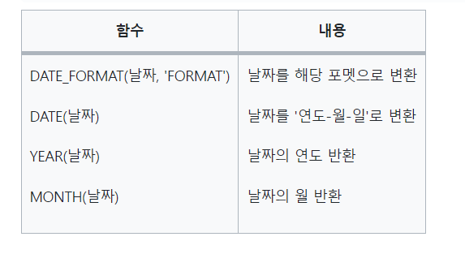

## 프로그래머스 datbase 실습 문제

### [`select 1번`](https://school.programmers.co.kr/learn/courses/30/lessons/151136)
```
SELECT FLOOR(AVG(DAILY_FEE)) AS AVERAGE_FEE
FROM CAR_RENTAL_COMPANY_CAR WHERE CAR_TYPE = 'SUV'
```


### [`select 2번`](https://school.programmers.co.kr/learn/courses/30/lessons/144853)

```agsl
SELECT BOOK_ID,DATE_FORMAT(PUBLISHED_DATE, '%Y-%m-%d') AS PUBLISHED_DATE
FROM BOOK
WHERE CATEGORY = '인문' AND PUBLISHED_DATE LIKE '2021%' ORDER BY PUBLISHED_DATE;
```

- DATE_FORMAT 을 통해 날짜 출력을 지정할 수 있다.

### [`select 3번`](https://school.programmers.co.kr/learn/courses/30/lessons/132201)
```agsl
SELECT PT_NAME,PT_NO,GEND_CD,AGE,IFNULL(TLNO,'NONE') AS TLNO 
FROM PATIENT WHERE GEND_CD='W' AND AGE<=12 
ORDER BY AGE DESC,PT_NAME ASC;
```

- select 문에서 `IFNULL(column,value)` 을 작성하여 null 인 값에 원하는 값을 출력할 수 있다. 


### [`select 4번`](https://school.programmers.co.kr/learn/courses/30/lessons/131120)
- `SELECT DATE_FORMAT('2019-09-16 20:23:12', '%Y/%M/%D')`
- date_formate 은 뒤에 시간 까지 여서 조절하고 싶으면 위에 문장 처럼 조절



```sql
SELECT member_id,member_name,gender,DATE_FORMAT(DATE_OF_BIRTH,'%Y-%m-%d') AS DATE_OF_BIRTH
from member_profile
where date_of_birth like '%03%'  and tlno is not null and gender='w'
order by member_id;

```

### [`join 1번`](https://school.programmers.co.kr/learn/courses/30/lessons/133027)

```sql
-- 코드를 입력하세요
-- select * from first_half;
-- select * from july;

 SELECT fh.flavor from first_half as fh join july as ju on fh.flavor = ju.flavor
 group by ju.flavor
 order by sum(fh.total_order+ju.total_order) desc limit 3;

```
- 내용물을 확인을 하자....... 테이블에 딸기가 두번 입력되어 있는 경우가 있다,, 그룹을 해줘야 한다.
- 그래서 order by 에서도 sum 함수를 해야한다. 


### [`group by 1번`](https://school.programmers.co.kr/learn/courses/30/lessons/131123)
```sql
SELECT food_type,rest_id,rest_name,favorites from REST_INFO 
where (food_type, favorites ) in (select food_type,max(favorites)
      from rest_info group by food_type)
order by food_type desc;
```
- where 문에 다중으로 타입을 비교 가능하다.


### [`SUM, MAX, MIN 1번`](https://school.programmers.co.kr/learn/courses/30/lessons/131115)
```sql
SELECT product_id,product_name,product_cd,category,price as price 
from food_product where price = (select max(price) from food_product )
```

- where 절을 통해 찾고자 하는 튜플의 범위를 좁혀야한다.

### [`IS NULL 1번`](https://school.programmers.co.kr/learn/courses/30/lessons/131114)
```sql
SELECT WAREHOUSE_ID,warehouse_name,ADDRESS, 
CASE   WHEN freezer_yn IS NULL THEN "N"
        ELSE freezer_yn
    END AS freezer_yn 
    from FOOD_WAREHOUSE
where address like '경기도%'
order by warehouse_id;
```
```sql
CASE   WHEN freezer_yn IS NULL THEN "N"
  ELSE freezer_yn
  END AS freezer_yn 
```
 - `case when` 칼럼 조건 `then` 넣을 값  `else` 넣을 값 `end` as 별명