# Database
- 조직에 필요한 정보를 얻기 위해 논리적으로 연관된 데이터를 모아 구조적을 통합한 것
- #### 데이터의 검색과 변경 작업이 주 수행

#### 데이터 
- 관찰의 결과 (정량적, 실제 값)

#### 정보
- 데이터에 의미를 부여한 것

#### 지식
- 사물이나 현상에 대한 이해
***

## 데이터베이스의 데이터 특징
1. 통합된 데이터 : 데이터의 중복을 최소화
2. 저장된 데이터 : 컴퓨터 저장장치에 저장된 데이터
3. 운영 데이터 : 조직의 목적을 위해 사용되는 데이터
4. 공용 데이터 : 공동으로 사용되는 데이터

## 테이터베이스의 특징
1. 실시간 접근성 : 수 초 내에 결과를 서비스
2. 지속적인 변화 : 데이터 값은 시간에 따라 항상 바뀜
3. 동시 공유 : 데이터베이스에접근하는 프로그램이 여러 개 있다는 의미
4. 내용에 따른 참조 : 데이터의 물리적인 위치가 아니라 데이터 값에 따라 참조

### 데이터베이스 구성
1. DBMS : 소프트웨어 프로그램으로 데이터베이스를 관리하는 기능을 하며, 사용자에게 편리하고효율적인 데이터베이스 사용 환경을 제공
2. 데이터베이스 : 데이터를 모아 둔 토대, 조직체의 응용 시스템들이 공용으로 사용하는 운영 데이터들이구조적 으로 통합하여 저장된 데이터로 컴퓨터 내부의 하드디스크에 저장
3. 데이터 모델 : 데이터베이스 시스템에서 데이터를 저장하는 이론적 방법에 관한 것으로, 데이터베이스에데이터가 어떻게 구조화되어 저장되는지를 결정

#### 데이터베이스 시스템
- 서버 : 데이터 소유
- 클라이언트 : 데이터 요청
- DBMS 서버가 데이터의 일관성 유지, 복구, 동시 접근 제어 기능 수행
- 데이터를 표준화하며 무결성 (종복을 최소화해서 관리)을 유지


### SQL(Structured Query Language) 
- Data subLanguage 데이터 구조에 관한 데이터를 생성하고 처리하는 문법만을 가지고 있다.

#### 기능에 따라 분류
1. 데이터 정의어(DDL)
    - CREATE 생성, ALTER 수정, DROP 삭제  : 객체
2. 데이터 조작어(DML)
    - INSERT , UPDATE , DELETE : 테이블
3. 데이터 제어어(DCL)
    - GRANT, REVOKE, (COMMIT , ROLLBACK)
4. 데이터 질의어(DQL)
    - SELECT
5. TCL  : COMMIT , ROLLBACK (제어어의 속하는 TCL)

***

# 관계 데이터 모델

### 릴레이션 : 행과 열로 구성된 테이블
- 첫 번째 행(1, 축구의 역사, 굿스포츠, 7000)의 경우 네 개의 집합(set)에서 각각 원소 한 개씩 선택하여 만들어진 것으로 이 원소들이 관계(relationship)를 맺음 : 튜플
- ① 릴레이션 내에서 생성되는 관계 : 릴레이션 내 데이터들의 관계
- ② 릴레이션 간에 생성되는 관계 : 릴레이션 간의 관계 (외래키)

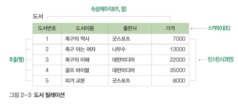

#### 릴리이션 스키마
- 속성(attribute) : 릴레이션 스키마의 열
- 도메인(domain) : 속성이 가질 수 있는 값의 집합
- 차수(degree) : 속성의 개수


```agsl
릴레이션 이름(속성1 : 도메인1, 속성2 : 도메인2, 속성3 : 도메인3 …)

• 예) 도서 (도서번호, 도서이름, 출판사, 가격)
• 도서 (도서번호:integer, 도서이름:char(40), 출판사:char(40), 가격:integer)) 
```

#### 릴레이션 인스턴스 (실존하는 튜플)
- 투플(tuple) : 릴레이션의 행
- 카디날리티(cardinality) : 투플의 수

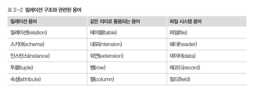

### 릴레이션의 특징


- 같은 튜플 저장 : 개체 무결성 위반

- 관계 대수 : crud -- select
- 제약 조건 : primary key, unique, default 등등

- 문제


- 정답 2(외연: 인스턴스, 내포 : 스키마), 4, 3(투플 : 릴레이션의 행을 말하며 속성의 모임으로 구성)
- 인스턴스 : 테이블에 실제로 저장되는 데이터의 집합

# 무결성 제약조건
- 데이터베이스는 데이터 저장 시
  - 일관성 유지
  - 중복을 최소화
  - 데이터의 신뢰성을 유지
- 데이터의 삽입, 삭제 , 수정 시 여러가지 제약조건이 따른다.

## 키
- 특정 튜플을 식별 (primary key)
- 릴레이션간의 관계 맺는데 사용(foreign key)

### 슈퍼키
- 튜플을 유일하게 식별할 수 있는 하나의 속성 혹은 속성 집합
- EX) (주민번호), (주민번호, 이름), (주민번호, 이름, 주소), (주민번호, 이름, 핸드폰),
  (고객번호), (고객번호, 이름, 주소), (고객번호, 이름, 주민번호, 주소, 핸드폰) 등

### 후보키
- 튜플을 유일하게 식별할 수 있는 속성의 `최소` 집합
- 위에 예제 기준이면 주민번호 , 고객번호만 후보키가 될 수 있음 `최소` 집합 이니까
- 주문 릴레이션의 후보키는 2개의 속성을 합한 (고객번호 , 도서번호)가 됨.  (각각의 테이블에서는 둘이 primary ket이며 둘을 복합하면 유니크 값이 됨)
  - 참고로 이렇게 2개 이상의 속성으로 이루어진 키를 복합키(composite key)라고 함

### 기본키
- 후보키 중 하나 선정
   - 투플 고유한 값
   - not null
   - 키 값 변동 없어야함
   - 최대한 적은 수의 속성
   - 스키마에 밑줄을 그어서 표현
   - 이론 상 기본키는 복합요소도 null 이 있으면 안된다.
   - sql 작성시에는 복합요소의 null을 받기는 한다.
   - 하지만 dbms에서 거절하는 경우가 많다.

### 대리키
- 기본키가 보안을 요하거나, 여러 개의 속성으로 구성되어 복잡하거나, 마땅한 기본키가 없을 때는 일련번호 같은`가상의속성`을 만들어 기본키로 삼는 경우가 있음. 이러한 키를 `대리키(surrogate key)` 혹은 `인조키(artificial key)`라고함
- DBMS나 관련 소프트웨어에서 임의로 생성하는 값으로 사용자가 직관적으로 그 값의 의미를 알 수 없음
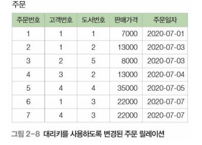
- 기본키가 (고객번호,도서번호)
- 대리키로 주문번호를 임의로 생성해준 것

### 대체키
- 후보키 중에서 기본키로 선정되지 않은 것


### 외래키
- 다른 릴레이션의 기본키를 참조하는 속성

#### 외래키 특징
- 관계 데이터 모델의 릴레이션 간의 관계를 표현함. 
- 다른 릴레이션의 기본키를 참조하는 속성임. 
- **참조하고(외래키) 참조되는(기본키) 양쪽 릴레이션의 도메인은 서로 같아야 함.**
- **참조되는(기본키) 값이 변경되면 참조하는(외래키) 값도 변경됨.**
- NULL 값과 중복 값 등이 허용됨. 
- 자기 자신의 기본키를 참조하는 외래키도 가능함. 
- 외래키가 기본키의 일부가 될 수 있음.

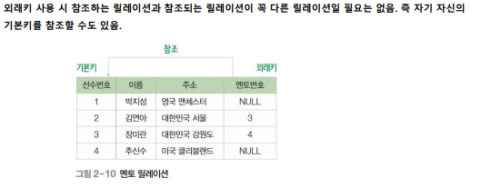

### 키 요약
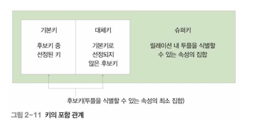

***

## 무결성 제약조건
1. 데이터 무결성
   - 데이터베이스에 저장된 데이터의 일관성과 정확성을 지키는 것을 말함.
2. 도메인 무결성 제약조건
   - 도메인 제약(domain constraint)이라고도 하며, 릴레이션 내의 투플들이 각 속성의 도메인에 지정된 값만을 가져야 한다는 조건
   - SQL 문에서 데이터 형식(type), 널(null/not null), 기본 값(default), 체크(check) 등을 사용하여 지정할 수 있음.
3. 개체 무결성 제약조건
   - 기본키 제약(primary key constraint)이라고도 함. 
   - 릴레이션은 기본키를 지정하고 그에 따른 무결성 원칙 즉, 기본키는 NULL 값을 가져서는 안 되며 릴레이션 내에 오직 하나의 값만 존재해야 한다는 조건
   - 삽입: 기본키 값이 같으면 금지
   - 수정: 기본키와 값이 같거나 null로 수정 금지
   - 삭제: 즉시 수행
4. 참조 무결성 제약조건
   - 외래키 제약(foreign key constraint)이라고도 하며, 릴레이션 간의 참조 관계를 선언하는 제약조건
   - 자식 릴레이션의 외래키는 부모 릴레이션의 기본키와 도메인이 동일해야 하며, 자식 릴레이션의 값이 변경될 때 부모 릴레이션의 제약을 받는다는 것


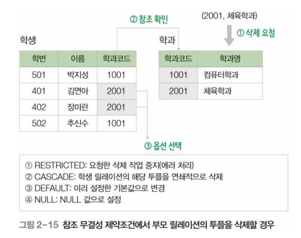

***

## 관계 대수
- 릴레이션에서 원하는 결과를 얻기 위해 수학의 대수와 같은 연산을 이용하여 질의하는 방법을 기술하는 언어

### 관계 대수
- 어떤 데이터를 `어떻게 찾는지`에 대한 `처리 절차`를 명시하는 절차적인 언어, DBMS 내부의 처리 언어로 사용
### 관계 해석
- `어떤 데이터`를 찾는지 명시하는 선언적인 언어 , DBMS의 표준 언어인 SQL의 이론적인 기반을제공

## 릴레이션의 수학적 개념
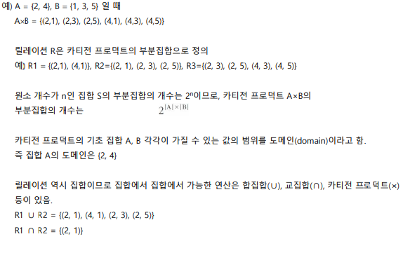
- 위에 A, B 에 따라 카티전 프로덕트 부분 집합 개수 는 2^6 이다

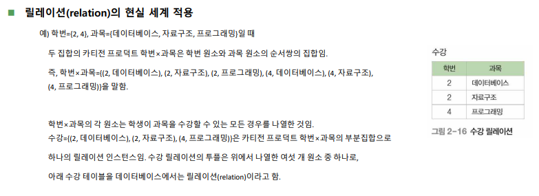
- 수강 릴레이션은 학번과 과목과 릴레이션 쉽을 이루고 있다.
- 집합들의 카티전 프로덕트는 수강 릴레이션이 가질 수 있는 모든 튜플의 경우의 수
- 우리가 보는 릴레이션(테이블) 은 카티전 프로덕트의 부분 집합인 것이다.

### 관계 대수 연산자
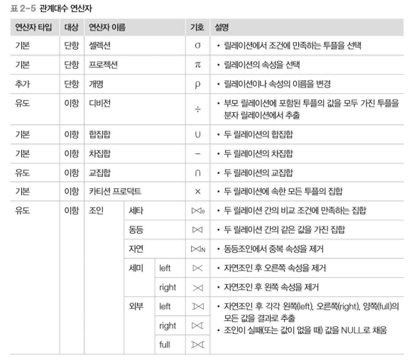
- 순수 관계 연산 : 셀렉션 (selection), 프로젝션 (projection), 조인 (join), 디비전 (division), 개명(rename)
- 일반 집합 연산 : union, intersection, difference, cartesian product
- 외부 조인은 모든 값 추출 하고 없는 부분은 null로 채움
- 세미 조인은 없으면 추출 안하고 제거해버림


## 관계대수식
- 해 결과 릴레이션을 찾는 절차를 기술한 언어로, 이 연산을 수행하기 위한 식을 관계대수식(relational algebra expression)이라고 함


### selection
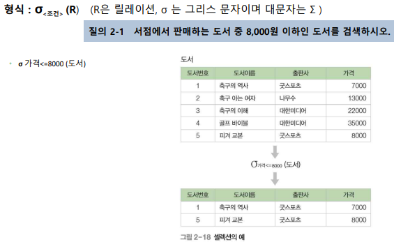


- where 로 뽑는 것과 유사

### projection

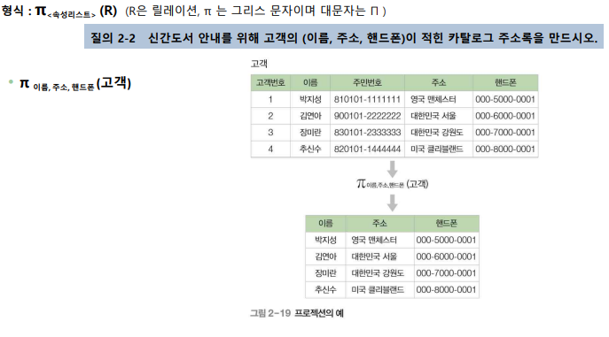

- 속성만을 추출하는 것과 유사

### union 합집합


- 중복제거해서 합침

### 교집합

- 겹치는 요소만 출력

### 차집합
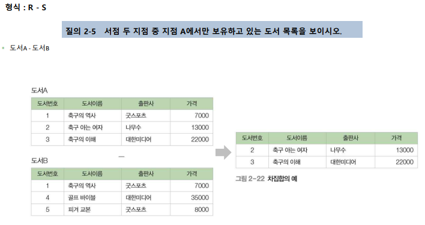
- 좌항 집합에서 우항집항과 겹치는 부분만 삭제

### cartesian product

- 튜플 곱, 튜플끼리 순서쌍 만드는 것

### join
- 두 릴레이션의 `공통 속성`을 기준으로 속성 값이 같은 투플을 수평으로 결합하는 연산
- 조인을 수행하기 위해서는 두 릴레이션의 조인에 참여하는 `공통 속성이 서로 동일한 도메인`으로 구성되어야 함
- 조인 연산의 결과는 공통 속성의 속성 값이 동일한 투플 만을 반환함


#### 세타조인
- 조건에 따라 하는 것


#### 동등조인
- 세타조인에서 조건 연산자 = 쓴거

#### 자연조인
- 조인에 들어간 조건이 세타조인 때처럼 두번 안나오고 한번만 나오는 것

#### 외부조인
- 왼쪽, 오른쪽, 완전 조인에 따라 없는 값은 null 로 저장
- 방향 정해진 곳은 모두 나오게 하는 게 포인트

#### 세미조인
- 자연 조인 후에 한쪽에 릴레이션 결과만 반환, 닫힌쪽만


### division
- 우측 집합에 원소를 좌측 집합에 있는지 확인하고 있으면 반환


***
- 문제
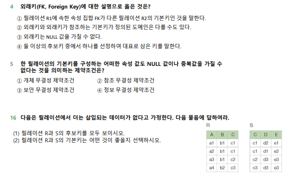
정답
- 1번 1, 
- 2번 2,
- 3번 1) r: A, S: (C,E),(C,D)
   -  2) r : a , S: (c,e)

***

## db 퀴즈1 오답노트
1. 테이블은 1개 이상의 열과 0개 이상의 행으로 이루어져 있고, 복잡한 데이터도 하나의 테이블에 저장하는게 좋다
2. **외래키도 기본키 요소로 쓰일 수 있다.**
3. **하지만 기본키 요소가 2개 이상 이라면, 거기에 포함되 있는 요소는 null 값이 안된다..**
4. 시험에서 commit 과 rollback 은 TCL 인것을 인지 하자
5. Where 문은 별명에 쓰면 오류 난다. 하지만 order by 는 별명에 써도 된다.
6. union 은 select 한 요소가 같아야 가능 하다.
7. 시스팀 카탈로그(데이터 사전) : 데이터 객체에 대한 정의나 명세 정보 유지, dbms가 생성하고 유지하는 데이터베이스 내의 특별한 테이블의 집합체, 카탈로그에 저장된 정보를 메타 데이터

*** 

## [**데이터베이스 실습 기본**](databaseREAD2.md)
## [**데이터베이스 실습 기본2**](databaseREAD3.md)
## [**데이터베이스 실습 기본3**](databaseREAD4.md)
## [**데이터베이스 실습 기본4**](databaseREAD5.md)
## [**데이터베이스 실습 기본5**](databaseREAD6.md)
## [**데이터베이스 실습 기본6**](databaseREAD7.md)
## [**데이터베이스 실습 기본7**](databaseREAD8.md)

***

