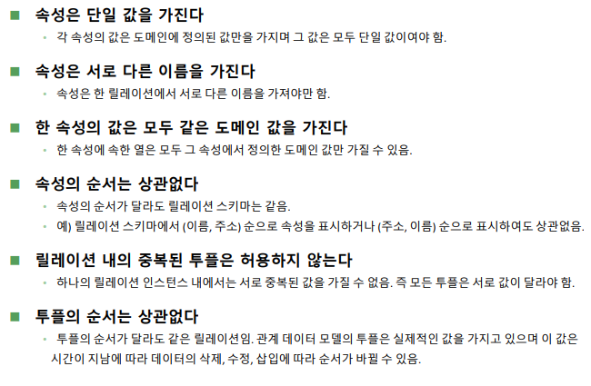

# Database
- 조직에 필요한 정보를 얻기 위해 논리적으로 연관된 데이터를 모아 구조적을 통합한 것
- #### 데이터의 검색과 변경 작업이 주 수행

#### 데이터 
- 관찰의 결과 (정량적, 실제 값)

#### 정보
- 데이터에 의미를 부여한 것

#### 지식
- 사물이나 현상에 대한 이해
***

## 데이터베이스의 데이터 특징
1. 통합된 데이터 : 데이터의 중복을 최소화
2. 저장된 데이터 : 컴퓨터 저장장치에 저장된 데이터
3. 운영 데이터 : 조직의 목적을 위해 사용되는 데이터
4. 공용 데이터 : 공동으로 사용되는 데이터

## 테이터베이스의 특징
1. 실시간 접근성 : 수 초 내에 결과를 서비스
2. 지속적인 변화 : 데이터 값은 시간에 따라 항상 바뀜
3. 동시 공유 : 데이터베이스에접근하는 프로그램이 여러 개 있다는 의미
4. 내용에 따른 참조 : 데이터의 물리적인 위치가 아니라 데이터 값에 따라 참조

### 데이터베이스 구성
1. DBMS : 사용자와 데이터베이스를 연결 시켜주는 소프트웨어
2. 데이터베이스 : 데이터를 모아 둔 토대
3. 데이터 모델 : 데이터가 저장되는 기법에 관한 내용

#### 데이터베이스 시스템
- 서버 : 데이터 소유
- 클라이언트 : 데이터 요청
- DBMS 서버가 데이터의 일관성 유지, 복구, 동시 접근 제어 기능 수행
- 데이터를 표준화하며 무결성 (종복을 최소화해서 관리)을 유지


### SQL(Structured Query Language) 
- Data subLanguage 데이터 구조에 관한 데이터를 생성하고 처리하는 문법만을 가지고 있다.

#### 기능에 따라 분류
1. 데이터 정의어(DDL)
    - CREATE 생성, ALTER 수정, DROP 삭제  : 객체
2. 데이터 조작어(DML)
    - INSERT , UPDATE , DELETE : 테이블
3. 데이터 제어어(DCL)
    - GRANT, REVOKE, COMMIT , ROLLBACK
4. 데이터 질의어(DQL)
    - SELECT
5. TCL  : COMMIT , ROLLBACK (제어어의 속하는 TCL)

***

# 관계 데이터 모델

### 릴레이션 : 행과 열로 구성된 테이블
- 첫 번째 행(1, 축구의 역사, 굿스포츠, 7000)의 경우 네 개의 집합(set)에서 각각 원소 한 개씩 선택하여 만들어진 것으로 이 원소들이 관계(relationship)를 맺음 : 튜플
- ① 릴레이션 내에서 생성되는 관계 : 릴레이션 내 데이터들의 관계
- ② 릴레이션 간에 생성되는 관계 : 릴레이션 간의 관계 (외래키)


#### 릴리이션 스키마
- 속성(attribute) : 릴레이션 스키마의 열
- 도메인(domain) : 속성이 가질 수 있는 값의 집합
- 차수(degree) : 속성의 개수


```agsl
릴레이션 이름(속성1 : 도메인1, 속성2 : 도메인2, 속성3 : 도메인3 …)

• 예) 도서 (도서번호, 도서이름, 출판사, 가격)
• 도서 (도서번호:integer, 도서이름:char(40), 출판사:char(40), 가격:integer)) 
```

#### 릴레이션 인스턴스 (실존하는 튜플)
- 투플(tuple) : 릴레이션의 행
- 카디날리티(cardinality) : 투플의 수


### 릴레이션의 특징



***

## [**데이터베이스 실습 기본**](databaseREAD2.md)
## [**데이터베이스 실습 기본2**](databaseREAD3.md)


