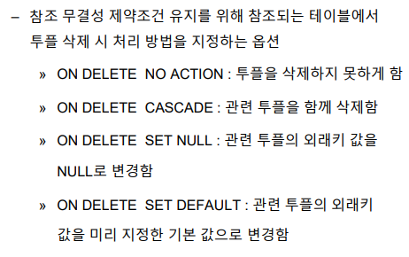
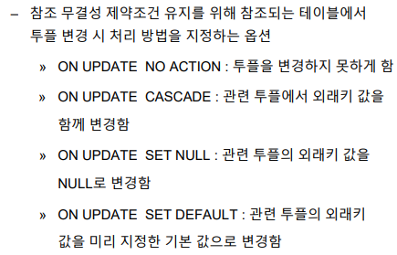
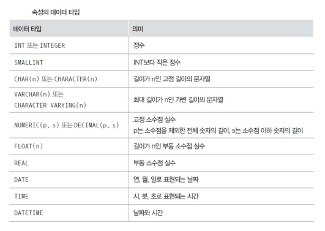
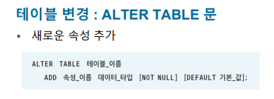
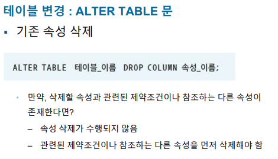
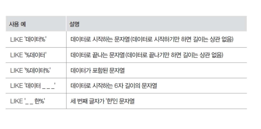

# SSGMARKET 실습

1. db 만들기
```agsl
mysql> create database ssgmarket
    -> ;
Query OK, 1 row affected (0.01 sec)

mysql> show databases;
+--------------------+
| Database           |
+--------------------+
| information_schema |
| mysql              |
| performance_schema |
| sakila             |
| sinsaegebookdb     |
| ssgmarket          |
| sys                |
| testdb             |
| world              |
+--------------------+
```

2. 테이블 파악하기
- 언더바 있는 칼럼은 primary key

3. 테이블 만들기 
```agsl
mysql> CREATE TABLE CUSTOMER(
    -> CUSTOMER_ID VARCHAR(20) NOT NULL,
    -> NAME VARCHAR(20) NOT NULL,
    -> AGE INT,
    -> GRADE VARCHAR(10) NOT NULL,
    -> JOB VARCHAR(30),
    -> POINT INT DEFAULT 0,
    -> PRIMARY KEY(CUSTOMER_ID));
Query OK, 0 rows affected (0.05 sec)

mysql> SHOW TABLES;
+---------------------+
| Tables_in_ssgmarket |
+---------------------+
| customer            |
+---------------------+
1 row in set (0.00 sec)
```

4. 값 넣기
```agsl

mysql> insert into customer values(
    -> 'apple','정소화',20,'gold','학생',1000);
Query OK, 1 row affected (0.01 sec)

mysql> select * from customer;
+-------------+--------+------+-------+------+-------+
| CUSTOMER_ID | NAME   | AGE  | GRADE | JOB  | POINT |
+-------------+--------+------+-------+------+-------+
| apple       | 정소화 |   20 | gold  | 학생 |  1000 |
+-------------+--------+------+-------+------+-------+
1 row in set (0.00 sec)

mysql> commit;
Query OK, 0 rows affected (0.00 sec)

```
- insert 명은 commit; 을 해야 rollback 을 안할 수 있음

5.  product 테이블 만들기
```agsl
mysql> create table product(
    -> PRODUCT_ID CHAR(3) NOT NULL,
    -> PRODUCT_NAME VARCHAR(20),
    -> AMOUNT INT,
    -> PRICE INT,
    -> P_COMPANY VARCHAR(20),
    -> PRIMARY KEY(PRODUCT_ID),
    -> CHECK(AMOUNT >=0 AND AMOUNT <= 10000));
Query OK, 0 rows affected (0.04 sec)

mysql> describe product;
+--------------+-------------+------+-----+---------+-------+
| Field        | Type        | Null | Key | Default | Extra |
+--------------+-------------+------+-----+---------+-------+
| PRODUCT_ID   | char(3)     | NO   | PRI | NULL    |       |
| PRODUCT_NAME | varchar(20) | YES  |     | NULL    |       |
| AMOUNT       | int(11)     | YES  |     | NULL    |       |
| PRICE        | int(11)     | YES  |     | NULL    |       |
| P_COMPANY    | varchar(20) | YES  |     | NULL    |       |
+--------------+-------------+------+-----+---------+-------+
```

- check문을 통하여 저장할 값의 범위 및 조건을 정해둘 수 있다.

6. 값 여러개 넣기
```agsl
mysql> insert into product values('p01','그냥만두',5000,4500,'대한식품'),
    -> ('p02','매운쫄면',2500,5500,'민국푸드'),
    -> ('p03','콩떡파이',3600,2600,'한빛제과'),
    -> ('p04','맛난초콜릿',1250,2500,'한빛제과'),
    -> ('p05','얼큰라면',2200,1200,'대한식품'),
    -> ('p06','통통우동',1000,1550,'민국푸드'),
    -> ('p07','달콤비스킷',1650,1500,'한빛제과');
Query OK, 7 rows affected (0.01 sec)
Records: 7  Duplicates: 0  Warnings: 0

mysql> select * from product;
+------------+--------------+--------+-------+-----------+
| PRODUCT_ID | PRODUCT_NAME | AMOUNT | PRICE | P_COMPANY |
+------------+--------------+--------+-------+-----------+
| p01        | 그냥만두     |   5000 |  4500 | 대한식품  |
| p02        | 매운쫄면     |   2500 |  5500 | 민국푸드  |
| p03        | 콩떡파이     |   3600 |  2600 | 한빛제과  |
| p04        | 맛난초콜릿   |   1250 |  2500 | 한빛제과  |
| p05        | 얼큰라면     |   2200 |  1200 | 대한식품  |
| p06        | 통통우동     |   1000 |  1550 | 민국푸드  |
| p07        | 달콤비스킷   |   1650 |  1500 | 한빛제과  |
+------------+--------------+--------+-------+-----------+
```

8. 값 수정이 필요하다 UPDATE
```agsl
mysql> update customer set customer_id='melon' where name ='성원용';
```

-WHERE로 원하는 튜플을 찾아내서 거기에 원하는 값으로 바꾸자

9. 외래키를 포함한 테이블 생성
```agsl
mysql> create table ORDERS(
    -> ORDER_PRODUCT CHAR(4),
    -> CUSTOMER_ID VARCHAR(20) NOT NULL,
    -> PRODUCT_ID CHAR(3) NOT NULL,
    -> AMOUNT INT,
    -> ADDRESS VARCHAR(30),
    -> ORDER_DATE DATE,
    -> PRIMARY KEY(ORDER_PRODUCT),
    -> FOREIGN KEY(CUSTOMER_ID) REFERENCES CUSTOMER(CUSTOMER_ID),
    -> FOREIGN KEY(PRODUCT_ID) REFERENCES PRODUCT(PRODUCT_ID));
Query OK, 0 rows affected (0.06 sec)

mysql> SHOW TABLES;
+---------------------+
| Tables_in_ssgmarket |
+---------------------+
| customer            |
| orders              |
| product             |
+---------------------+
3 rows in set (0.00 sec)

mysql> DESCRIBE ORDERS
    -> ;
+---------------+-------------+------+-----+---------+-------+
| Field         | Type        | Null | Key | Default | Extra |
+---------------+-------------+------+-----+---------+-------+
| ORDER_PRODUCT | char(4)     | NO   | PRI | NULL    |       |
| CUSTOMER_ID   | varchar(20) | NO   | MUL | NULL    |       |
| PRODUCT_ID    | char(3)     | NO   | MUL | NULL    |       |
| AMOUNT        | int(11)     | YES  |     | NULL    |       |
| ADDRESS       | varchar(30) | YES  |     | NULL    |       |
| ORDER_DATE    | date        | YES  |     | NULL    |       |
+---------------+-------------+------+-----+---------+-------+
```

10. orders 테이블에 값 넣기
```agsl
mysql> INSERT INTO ORDERS VALUES('o02','melon','p01',5,'인천시 계양구','2022-01-10'),
    -> ('o03','banana','p06',45,'경기도 부천시','2022-01-11'),
    -> ('o04','carrot','p02',8,'부산시 금정구','2022-02-01'),
    -> ('o05','melon','p06',36,'경기도 용인시','2022-02-20'),
    -> ('o06','banana','p01',19,'충청북도 보은군','2022-03-02'),
    -> ('o07','apple','p03',22,'서울시 영등포구','2022-03-15'),
    -> ('o08','pear','p02',50,'강원도 춘천시','2022-04-10'),
    -> ('o09','banana','p04',15,'전라남도 목포시','2022-04-11'),
    -> ('o10','carrot','p03',20,'경기도 안양시','2022-05-22');
Query OK, 9 rows affected (0.01 sec)
Records: 9  Duplicates: 0  Warnings: 0

mysql> SELECT * FROM ORDERS;
+---------------+-------------+------------+--------+-----------------+------------+
| ORDER_PRODUCT | CUSTOMER_ID | PRODUCT_ID | AMOUNT | ADDRESS         | ORDER_DATE |
+---------------+-------------+------------+--------+-----------------+------------+
| o01           | apple       | p03        |     10 | 서울시 마포구   | 2022-01-01 |
| o02           | melon       | p01        |      5 | 인천시 계양구   | 2022-01-10 |
| o03           | banana      | p06        |     45 | 경기도 부천시   | 2022-01-11 |
| o04           | carrot      | p02        |      8 | 부산시 금정구   | 2022-02-01 |
| o05           | melon       | p06        |     36 | 경기도 용인시   | 2022-02-20 |
| o06           | banana      | p01        |     19 | 충청북도 보은군 | 2022-03-02 |
| o07           | apple       | p03        |     22 | 서울시 영등포구 | 2022-03-15 |
| o08           | pear        | p02        |     50 | 강원도 춘천시   | 2022-04-10 |
| o09           | banana      | p04        |     15 | 전라남도 목포시 | 2022-04-11 |
| o10           | carrot      | p03        |     20 | 경기도 안양시   | 2022-05-22 |
+---------------+-------------+------------+--------+-----------------+------------+
```

11.  테이블 생성 문법

- ####  primary key(unique + not null)
  - 예) PRIMARY KEY(주문고객, 주문제품)
- #### UNIQUE
  - 대체키 지정
  - null 값 허용
  - 예) UNIQUE(고객이름)
- #### FOREIGN KEY
  - 다른 테이블의 primary key
  - 예) FOREIGN KEY(소속부서) REFERENCES
    부서(부서번호)
    ON DELETE CASCADE ON UPDATE CASCADE




- #### CHECK
    - 테이블 생성 때 스키마의 조건을 걸어 두는 것
  - 예) CHECK(재고량 >= 0 AND 재고량<= 10000)
  - 예) CONSTRAINT CHK_CPY CHECK(제조업체= ‘한빛제과’)

- '값은 대소문자를 비교한다'




- #### ALTER TBALE






12. 배송업체 테이블 생성
```agsl
mysql> create table DELIVERY(
    -> DELINO INTEGER NOT NULL,
    -> NAME VARCHAR(20),
    -> ADDRESS VARCHAR(30),
    -> TEL VARCHAR(10),
    -> PRIMARY KEY(DELINO));
Query OK, 0 rows affected (0.05 sec)

mysql> describe DELIVERY;
+---------+-------------+------+-----+---------+-------+
| Field   | Type        | Null | Key | Default | Extra |
+---------+-------------+------+-----+---------+-------+
| DELINO  | int(11)     | NO   | PRI | NULL    |       |
| NAME    | varchar(20) | YES  |     | NULL    |       |
| ADDRESS | varchar(30) | YES  |     | NULL    |       |
| TEL     | varchar(10) | YES  |     | NULL    |       |
+---------+-------------+------+-----+---------+-------+
```


13. ALTER 문 사용
```agsl
mysql> ALTER TABLE CUSTOMER ADD JOINDATE DATE;
Query OK, 0 rows affected (0.04 sec)
Records: 0  Duplicates: 0  Warnings: 0

mysql> describe CUSTOMER;
+-------------+-------------+------+-----+---------+-------+
| Field       | Type        | Null | Key | Default | Extra |
+-------------+-------------+------+-----+---------+-------+
| CUSTOMER_ID | varchar(20) | NO   | PRI | NULL    |       |
| NAME        | varchar(20) | NO   |     | NULL    |       |
| AGE         | int(11)     | YES  |     | NULL    |       |
| GRADE       | varchar(10) | NO   |     | NULL    |       |
| JOB         | varchar(30) | YES  |     | NULL    |       |
| POINT       | int(11)     | YES  |     | 0       |       |
| JOINDATE    | date        | YES  |     | NULL    |       |
```

14. 다시 칼럼 삭제
```agsl
mysql> ALTER TABLE CUSTOMER drop column joindate;
Query OK, 0 rows affected (0.23 sec)
Records: 0  Duplicates: 0  Warnings: 0

mysql> describe CUSTOMER;
+-------------+-------------+------+-----+---------+-------+
| Field       | Type        | Null | Key | Default | Extra |
+-------------+-------------+------+-----+---------+-------+
| CUSTOMER_ID | varchar(20) | NO   | PRI | NULL    |       |
| NAME        | varchar(20) | NO   |     | NULL    |       |
| AGE         | int(11)     | YES  |     | NULL    |       |
| GRADE       | varchar(10) | NO   |     | NULL    |       |
| JOB         | varchar(30) | YES  |     | NULL    |       |
| POINT       | int(11)     | YES  |     | 0       |       |
+-------------+-------------+------+-----+---------+-------+
```

15. 고객 테이블에 20세 이상의 고객만 가입할수있는 무결성 제약조건 추가
```agsl
mysql> ALTER TABLE CUSTOMER ADD CONSTRAINT OVERAGE CHECK(AGE >= 20);
Query OK, 7 rows affected (0.13 sec)
Records: 7  Duplicates: 0  Warnings: 0
```
- 조건 별명을 `overage` 로 20살 이상만 가능하게 `chekc` 로 넣어주기
```agsl
mysql> insert into customer values('ppp','서유미',18,'골드','학생',1000);
ERROR 3819 (HY000): Check constraint 'OVERAGE' is violated.
```

- 오류 나오는 것 확인
```agsl
mysql> select * from information_schema.table_constraints where constraint_schema = 'ssgmarket';
+--------------------+-------------------+-----------------+--------------+------------+-----------------+----------+
| CONSTRAINT_CATALOG | CONSTRAINT_SCHEMA | CONSTRAINT_NAME | TABLE_SCHEMA | TABLE_NAME | CONSTRAINT_TYPE | ENFORCED |
+--------------------+-------------------+-----------------+--------------+------------+-----------------+----------+
| def                | ssgmarket         | PRIMARY         | ssgmarket    | product    | PRIMARY KEY     | YES      |
| def                | ssgmarket         | PRIMARY         | ssgmarket    | orders     | PRIMARY KEY     | YES      |
| def                | ssgmarket         | PRIMARY         | ssgmarket    | delivery   | PRIMARY KEY     | YES      |
| def                | ssgmarket         | PRIMARY         | ssgmarket    | customer   | PRIMARY KEY     | YES      |
| def                | ssgmarket         | orders_ibfk_1   | ssgmarket    | orders     | FOREIGN KEY     | YES      |
| def                | ssgmarket         | orders_ibfk_2   | ssgmarket    | orders     | FOREIGN KEY     | YES      |
| def                | ssgmarket         | product_chk_1   | ssgmarket    | product    | CHECK           | YES      |
| def                | ssgmarket         | OVERAGE         | ssgmarket    | customer   | CHECK
```
- overage 조건 추가되어있는거 확인 가능
- ibfk --> 외래키
- chk --> 체크문

16.  위에서 만든 조건 제거하기
`ALTER TABLE customer drop constraint overage;`

`ALTER TABLE customer drop check overage;`
- 이유는 모르지만 drop check 하니 된다.

17. 배송 테이블 삭제
```agsl
mysql> drop table delivery;
Query OK, 0 rows affected (0.03 sec)

mysql> show tables;
+---------------------+
| Tables_in_ssgmarket |
+---------------------+
| customer            |
| orders              |
| product             |
+---------------------+
```

18. 고객 테이블에서 고객아이디, 고객이름 등급속성 검색
```agsl
mysql> select customer_id,name,grade from customer;
+-------------+--------+--------+
| customer_id | name   | grade  |
+-------------+--------+--------+
| apple       | 정소화 | gold   |
| banana      | 김선우 | vip    |
| carrot      | 고명석 | gold   |
| melon       | 성원용 | gold   |
| orange      | 김용욱 | silver |
| peach       | 오형준 | silver |
| pear        | 채광주 | silver |
+-------------+--------+--------+
```

19. 고객테이블에서 성이 김 씨 인 고객의 고객 이름 나이 등급 적립금 검색
```agsl
mysql> select name,age,grade,point from customer where name like '김%';
+--------+------+--------+-------+
| name   | age  | grade  | point |
+--------+------+--------+-------+
| 김선우 |   25 | vip    |  1000 |
| 김용욱 |   22 | silver |     0 |
+--------+------+--------+-------+
```
`select name,age,grade,point from customer where name like ('김%');`
- like () 가능


20. 제품 테이블에서 제조업체의 수를 검색
```agsl

mysql> select count(p_company) as '제조업체 수' from product group by p_company;
+-------------+
| 제조업체 수 |
+-------------+
|           2 |
|           2 |
|           3 |
+-------------+
```
- 회사별로 몇개의 제품이 있는지 나와버림

```agsl
mysql> select count(distinct p_company)as '제조업체 수'  from product;
+-------------+
| 제조업체 수 |
+-------------+
|           3 |
+-------------+
```
- 이러면 업체 몇개인지 나옴

21. 


