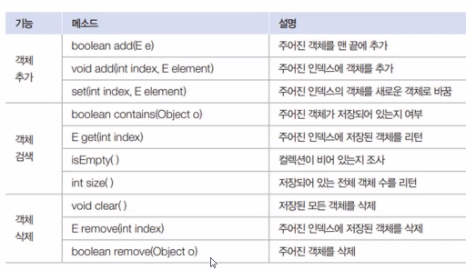
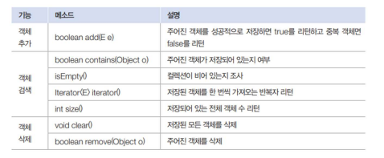
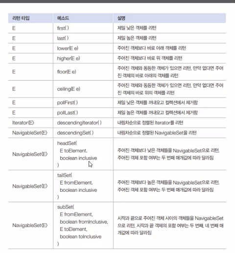
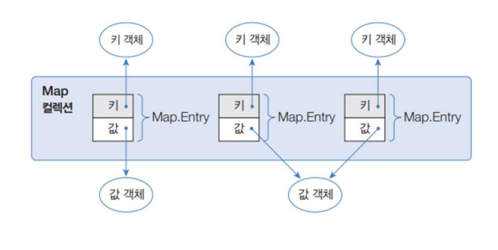

# Collection Framework

- 프레임워크 : 미리 준비되어진 구조나 기능
- 컬렉션 : 객체를 수집하고 저장해서 관리 (CRUD)


- map 은 collection implement는 아니지만 자료구조로 묶어서 설명
- collection 은 Iterable<E> 을 상속중
- list set 은 공통된 메소드가 존재 (상속중이기 때문에 collection을)

## List

### VO, Dao 활용
- Dao 를 활용하여 main 에서 VO 를 숨김
- 객체의 데이터와 기능을 분리시켜서 재사용성 증가, 서로의 영향력을 감소

- [`BoardExample`](ListExample%2FBoardExample)
  - 활용 예제

#### ArrayList, Vector, linkedList

- index 가 있다 --- 순서가 있다, 인덱스로 검색 삭제 기능 제공
- 중복 객체 허용
- 순서에 따라 객체를 관리한다.

- arraylist는 삽입할때마다 공간을 만들어서(미리 공간을 확보함) 삽입 시간이 오래걸림
- 

#### Vector

- 벡터는 arraylist와 동일한 내부 구조
- vector는 동기화된 메소드로 구성되어 있어 멀티스레드가 동시에 vector 메소드를 실핼 할 수 없다.
#### LinkedList

#### [`LinkedListExample.java`](ListExample%2FLinkedlistEx%2FLinkedListExample.java)
- linkedlist의 입출력이 빈번할 때 속도는 arraylist 보다 빠르다
- 공간을 이미 확보한 상태에서 index 계산이 아닌 서로 연결을 하는 구조라 삽입 속도가 빠름
  - 미리 데이터 공간을 미리 할당하지 않아도 됨
    - 배열은 **미리 데이터 공간을 할당** 해야 함
- node의 연결들
- head 값이 있기 때문에 링크드리스트의 시작 주소값을 인지 할 수 있음
- 단검
  - 연결을 위한 별도 데이터 공간이 필요하므로, 저장공간 효율이 높지 않음
  - 연결 정보를 찾는 시간이 필요하므로 접근 속도가 느림
  - 중간 데이터 삭제시, 앞뒤 데이터의 연결을 재구성해야 하는 부가적인 작업 필요
- 부가적인 기능이 필요함(중간에 넣기, 검색하기)


## Set
#### HashSet, TreeSet

### HashSet
- 중복 객체 비허용 , null 도 하나만 가능
- 순서 x


  
- 다른 객체라도 hashCode() 메소드의 리턴값이 같고, equals() 메소드가true를 리턴하면동일한 객체라고 판단하고 중복 저장하지 않음
- class Member 를 hashset에 사용할려면 hashcode 와 equals 오버라이딩 해야함
***
#### hash set 혹은 hashmap의 키값에 class를 사용한다면, 구별을 하기 위하여 hashcode 와 equal의 오버라이딩이 필수다.
#### hashcode는 String 값에 사용 가능하며, 기본 hashcode 함수는 주소값을 16진법 정수로 표현하는 것이다.

1. **hashCode() 메서드는 항상 해시 코드를 반환하지 않는다.**
위 예제처럼 hashCode() 메서드를 재정의하면, 사용자가 원하는 값을 반환하도록 수정할 수 있습니다. 하지만, hashCode() 메서드를 재정의했다고 객체의 내부 주소가 바뀌는 것은 아닙니다. 재정의되지 않은 hashCode() 메서드는 객체의 내부 주소를 해시 코드로 변환하는 기능만 수행합니다.

2. **객체의 내부 주소가 변경되면 해시 코드도 변경된다.** 재정의되지 않은 hashCode() 메서드는 객체의 내부 주소를 해시 값으로 변환하여 반환합니다. 만약, 객체의 내부 주소가 변경되면 hashCode() 메서드의 반환 결과도 달라집니다.

***
  - 따라서 Member.java 파일에서 동일 객체를 구분하기 위하여 (오버라이딩 안하면 각기 다른 주소를 가진 객체 이기 때문에) 입력바든 이름의 hashcode 와 age를 더 하는 구조로 동일 객체를 확인.
- [`Member.java`](SetExample%2FMember.java)


- `iterator` 활용하여 검색 해서 빼옴

#### [`iterator 및 set 코드 확인`](SetExample%2FHashSetEx01.java)

### TreeSet

- node를 이용한 사이클을 이루지 않도록 구성한 데이터 구조
- 탐색 알고리즘 구현을 위해 많이 사용


- 메소드

- [`TreeSet 예제`](TreeSetEx%2FTreeSetEx.java)

***
***
## Map
#### HashMap, HashTable, TreeMap, Properties

- 키와 값이 1대1 페어링 되어 있는 구조
- 키는 중복저장 안됨
- 키와 값으로 구성된 엔트리
- 키값에 클래스가 들어간다면, 객체의 비교 구분을 하기 위하여 hashcode와 equals의 오버라이딩을 해야한다! (hashset 오버라이딩 참고)




### HashMap


#### [`해쉬맵과 set 및 Iterator 활용 예제`](HashMapExample%2FHashMapMain.java)


### Hashtable
- 해쉬맵과 다르게 멀티스레드에서 안전하게 사용 가능
- 
### Properties
- 해쉬테이블 자식 클래스
- 키와 값을 String으로 가져옴
- key = value 구조의 텍스트파일(.properties) 정보를 가져옴
#### [PropertiesEx.java](app%2FPropertiesEx.java) -- 사용 예제


### TreeMap
- map.entry 에 left, right가 추가 된 구조
- SortedMap 인터페이스로 구현
- ket 기준으로 정렬 된다
- 정렬 순서는 숫자, 알파벳 대문자, 소문자, 한글 순

#### [TreeMapEx 예제](TreeMapEx%2FTreeMapEx.java)


### 정렬 Comporable, Comparator

- String, Integer, Double 등 ---> compare() : 기본 오름차순
- 내림차순으로 하고 싶으면 매개변수 순서 바꾸면됨

#### Comparable
   - 정렬 수행할 때, 정렬기준이 되는 메서드를 정의해 놓는 인터페이스
   - Comporable 인터페이스를 
   - compareTo() 메소드를 원하는 정렬 기준대로 구현
   - 리턴되는 int값이 음수이면 현재 인스턴스가 비교대상인 인스턴스보다 작고, 양수이면 크고, 0 이면 같도록 하자

#### Comparator는 두 매개변수 객체를 비교하는 것이고, Comparable은 자기 자신과 매개변수 객체를 비교


- 메소드


#### [`comparable 기본 구조`](about_Comparator%2FSortingEx.java)
#### [`comparable 구조 예제`](about_Comparator%2FmemberComparator%2FMember.java)
#### [`Comparator 구조 예제 및 Arrays.sort() 내부 함수 정의`](about_Comparator%2FXYCompare%2FDotMain.java)
#### [`compaare 함수 구조 예제`](about_Comparator%2FExComparator%2FNode.java)
#### [`compareTo 구조 예제`](about_Comparator%2FExComparator%2FSampleNumber.java)
#### [`compareTo 람다 구조 예제`](about_Comparator%2FExComparator%2FSampleNumberComparator.java)
#### [`student Comparable, Comparator 과제`](about_Comparator%2FStudentComparator)

***

## 스택과 큐는 따로 공부를 하자

***

## 제너릭

- 자바 프로그래밍 언어의 타입 안정성 강화를 위해 도입
- 제너릭을 사용하면 타입을 매개변수화 할 수 있다.
  - 동일한 코드를 다른 타입에 사용할 수 있다.
- 제너릭 타입 매개 변수 정의 가능 한것들
  - 클래스
  - 인터페이스
  - 메서드
- 컴파일시 실제 타입으로 대체되어 타입 안정서을 보장 한다.

### 제너릭 클래스
- 하나 이상의 타입 매개변수가 있는 클래스
- ex) class MyGenericClass<T> {}   //T: 타입매개변수

#### 제너릭 클래스의 객체 생성
- MyGenericClass<Integer> obj = new MyGenericClass<Integer>();
- 타입 매개변수 Integer를 사용하여 MyGenericClass의 객체를 생성한다. 
- obj의 사용이 Integer 객체만 받도록 제한된다.

#### 제너릭 메소드
- 자체 타입 매개변수를 갖는 메서드
- 클래스 수준 타입 매개변수와 다른 자체 타입 매개변수를 가질 수 있다.
- public <T>void MyGenericMethod(T parameter1, T parameter2){}
- 타입 매개변수 T 가 있는 제너릭 메소드 MyGenericMethod 를 정의한다.

### 제너릭의 와일드 카드 (%)
- 와일드 카드는 유연성을 제공하고 알 수 없거나 여러 타입을 사용 할 수 있도록 지원
- 특정 타입이 중요하지 않는 객체 컬렉션을 작업할 때 유용
- 지정된 상한 또는 하한 타입의 모든 타입을 사용할 수 있도록 허용
- 제너릭 타입 매개변수를 다른 타입으로 대체할 수 있도록 지정이 가능하다.
  - 필요성 : 매개변수의 정확한 타입을 알 수 없거나, 관련이 없는 상황에서 타입안정성을 희생하지 않고 알 수 없는 타입을 처리할 수 있는 방법 제공
  - 자바 제너릭 와일드 카드는 물음표 기화로 표시한다. <?> 
    - 바인딩 되지 않은 와일드 카드('?') : 알 수 없는 타입을 나타낸다. 실제 타입 인수에 관심이 없는 상황에서 사용
  
    - ex) 알수 없는 요소의 리스트를 받아 문자열 표현을 출력해야하는 메서드 구현 
    - ```agsl
      public static void printList(List<?> list) {
      for(Object element : list) {print(element.toString());}
      }
      ```

    - 상한 와일드 카드 <? extends Type>
      - 지정된 타입의 하위 타입인 알 수 없는 타입을 나타낸다. 특정 클래스나 인터페이스에서 파생된 모든 타입 허용
      - ex2) 숫자 리스트의 합계를 계산하는 listTotal()
      ```agsl
      public static Double listTotal(List<? extends Number> nubers){
          double total= 0;
          for(Number number : nubers){
          total += number.doubleValue();}
          return total;
      } 
  - 하한 와일드 카드 <? super T>
    - 지정된 타입의 상위 타입인 알 수 없는 타입을 나타낸다. 특정 클래스 또는 인터페이스의 상위 타입인 모든 타입을 허용하려는데 유용
  - 지정된 하한 클래스와 동일하거나 상위 타입의 모든 타입을 사용할 수 있다.
  ```agsl
    public static void addElements (List < ? super Integer> list) { list.add(10); }
  // ? super Integer 사용하면 addElement() 메서드가 Object 또는 Number 와 같은 Integer 의 모든 상위 타입을 List 허용할 수 있다.
  // 정수와 Integer의 상위타입인 다른 모든 객체를 추가할 수 있다. 
    ```
  - 문제8 : 모든 타입의 ArrayList를 출력할 수 있는 printList 라는 메서드를 작성하세요. (단 와일드 카드를 사용하세요.)
  - [`문제 답안 코드 예제`](GenericEx%2Fwildcard%2FMyClassWildCardEx1.java)
  ```agsl
   public static void printList(List <?> list ) {
        for(Object element : list) {System.out.println(element.toString());
        }}
  ```
  - 문제9 : 객체 리스트를 받아들이고 리스트의 각요소를 출력하는 printList 메서드를 만들었습니다. 이 메서드를 Comparable 인터페이스를 구현하는 객체 리스트만 받아서 printList 할수 있도록 수정
- 타입 삭제
  - 타입 지우기 기능 지원

#### 제너릭이 필요한 이유
- 다양한 타입의 데이터에서 작동할 수 있는 재사용 가능한 코드를 만드는데 유용
  - 코드 중복 최소화
  - 코드 베이스를 유지 관리 편해진다
  - 컴파일 시에 타입 안정성을 제공하여 런타임 오류의 가능성을 줄 일 수 있다
- 타입 캐스팅의 필요성을 제거한다.

- ### [제너릭 실습 예제](GenericEx)


- https://hwan33.tistory.com/31 제너릭을 공부를 더해야한다
- https://inpa.tistory.com/entry/JAVA-%E2%98%95-%EC%A0%9C%EB%84%A4%EB%A6%ADGenerics-%EA%B0%9C%EB%85%90-%EB%AC%B8%EB%B2%95-%EC%A0%95%EB%B3%B5%ED%95%98%EA%B8%B0


