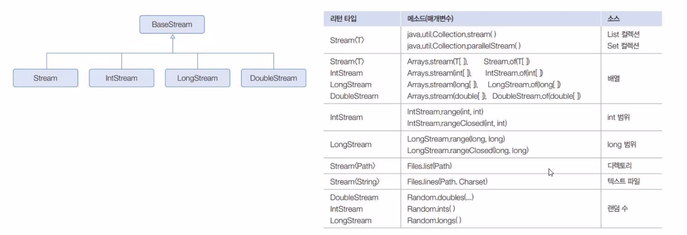

# 스트림

## 스트림이란?
- 데이터의 흐름 (stream)
- 데이터가 여러개가 있어야 흐름을 만들 수 있다.
- 스트림 데이터 종류 : 컬렉션 : list.stream 혹은 stream(list) , 배열 : Arrays.stream(배열)
- 스트림 데이터는 데이터 소스로 부터 추출한 연속적인 데이터
- 스트림 API : 연속적인 데이터의 흐름을 반복적으로 또는 연산하여 처리하는 기능 (map, reduce, filter, sort)

### 스트림 인터페이스

### 스트림 특징
- 스트림 연산은 기존 자료를 변경하지 않는다.
- 스트림 연산은 중간 연산과 최종연산 구분
- 한 번 생성하고 사용한 스트림은 재사용할 수 없다.
- 

## 중간 연산, 최종 연산
### 중간 연산
- .filter() : 조건에 맞는 요소 추출
- .map() : 조건에 맞는 요소 변환  ,, Stream으로 return해준다.
- .sorted() : 정렬
### 최종 연산
- 스트림의 자료를 소모하면서 연산을 수행한다.
- 최종 연산 이후에 스트림은 더 이상 다른 연산을 적용할 수 없다.
- .foreach() : 요소를 하나씩 꺼내옴  ,, 요소 하나씩 처리 가능 return이 void 여서 다른 메서드를 이용하는 것은 가능! 대표적으로 list.add
- .count() : 요소 개수
- .sum()
- .average()  
...

## 파이프라인 구성

## 컬렉션 객체와 스트림

## 여러 가지 연산