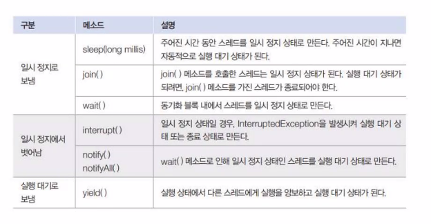

# 쓰레드

### 쓰레드에 앞서 OS
- 시스템(하드웨어)의 원할한 운영과 자원 관리를 효율적으로 해주는 소프트웨어

#### 멀티 태스킹 : 두가지 이상의 작업을 동시에 처리 , os가 멀티프로세스를 생성해서 처리
- 멀티 스레드: 프로그램 내부의 멀티태스킹
- 스레드 : 코드의 실행흐름, 프로그램 내부에 존재
#### 멀티 프로세스: 프로그램 단위의 멀티 태스킹
- 프로세스 : os에서 실행중인 프로그램
  - 프로그램 + 프로세스제어블록(PCB), 프로세스는 독립된 메모리 영역 할당
  - 프로세스는 code, data, heap stack 영역을 가진다.
  - 프로세스에는 각 쓰레드 별로 고유의 스택영역을 가진다.
  - 자바에서는 프로세스는 존재하지 않고 쓰레드만 존재
 
 
 
***
### 자바 쓰레드 생성 방법
1. Thread 클래스
   1. java.lang.Thread 클래스로부터 작업 스레드 객체를 직접 생성
        - Thread thread = new Thread(Runnable target);
            - Runnable 쓰레드가 작업을 실행할 때 사용하는 인터페이스
            - 구현 클래스는 run() 을 오버라이딩을 하여 스레드가 실행할 코드 작성
            - [**쓰레드 기본 예제**](BeepPrintThread.java)
            
         
   2. java.lang.Thread 클래스를 상속받아 생성
   
       

   - [`쓰레드 상태 종류`](https://docs.oracle.com/en/java/javase/17/docs/api/java.base/java/lang/Thread.State.html)
     - Starvation 은 ready 상태에서 무한 대기
     - Deadlock 은 asleep 상태에서 무한 대기
      
   - 쓰레드 정지 관련 메서드
     
     

2. Runnable 인터페이스 : run();

