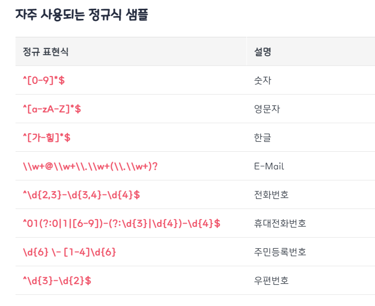

## regex

- 정규 표현식을 전문적으로 다루는 클래스인 java.util.regex 패키지를 제공해준다. 패키지 안의 클래스중 주로`Pattern` 클래스와 `Matcher` 클래스
- 정규식을 Pattern 객체로 미리 컴파일 해둘수 있어서 처리 속도가 좀 더 빠르고, 매칭된 데이터를 좀더 상세히 다룰 수 있다.

### Pattern 클래스

- 문자열을 정규표현식 패턴 객체로 변환해주는 역할
- 정규식 패턴 객체를 생성하려면 `compile()` 정적 메소드를 호출


- ^[a-zA-Z0-9+-\_.]+@[a-zA-Z0-9-]+\.[a-zA-Z0-9-.]+$ (이메일 다른 정규 표현식)

| 기호  |                                                                              설명 |                                                             예제 |
|:---:|--------------------------------------------------------------------------------:|---------------------------------------------------------------:|
|  .  |                                                                    임의의 문자 1개 의미 |                                                                |
|  ^  |                                                시작을 의미, []괄호 안에 있다면 일치하지 않은 것 의미 |                    ^a: a로 시작하는 단어, <br/>[^a] : a가 아닌 철자인 문자 1개 |
|  $  |                                                         $앞의 문자열로 문자가 끝나는지를 의미한다 |                                                 a$ : a로 끝나는 단어 |
| []  |                                                          [] 괄호 안의 문자가 있는지를 확인한다 |                  [ab][cd] : a,b중 한 문자와 c,d중 한 문자→ ac ad bc bd  |
| [^] | [] 대괄호 안에 ^ 문자가 있으면, 제외를 뜻함<br>- 대괄호 안에 ^ 가 쓰이면 제외의 뜻<br>-대괄호 밖에 ^ 가 쓰이면 시작점의 뜻 |                            [^a-z] : 알파벳 소문자 a부터 z까지를 제외한 모든 문자 
|  -  |                                                              사이의 문자 혹은 숫자를 의미한다 | [a-z] : 알파벳 소문자 a부터 z까지 하나<br>[a-z0-9] : 알파벳 소문자 전체,0~9 중 한 문자 
| \|  |                                                                              또는 |                                                [a\|b] : a 혹은 b |
| {}	 |                                                                              개수 |             a{3}b : a가 3번 온 후 b가 온다→ aab(x), aaab(o), aaaab(o) 
| \b  |                                                         공백, 탭, ",", "/" 등을 의미한다 |    apple\b : apple뒤에 공백 탭등이 있다→ apple juice (o), apple.com (x) 
| \B	 |                                                                          \b의 부정 |                                         apple\B→ apple.com (o) |
| \w	 |                                                                [a-zA-Z_0-9]와 동일 |                                                                |
| \W	 |                                                                  [^a-zA-Z_0-9]	 |                                                                |
|  ?  |                                                           앞의 표현식이 없거나 or 최대 한개만 |      a1? : 1이 최대 한개만 있거나 없을수도 있다→ a(o), a1(o), a11(x), a111(x) |
|  *   |                                                        앞의 표현식이 없거나 or 있거나 (여러개) |                                          a1* : 1이 있을수도 없을수도 있다 |
|    + |                            앞의 표현식이 1개 이상 or 여러개	                                                     |                                                                |
|  {n}	   |                         딱 n개 있다	                                                        |                                                                |
|   {n, m}  |                        n개 이상 m개 이하                                                         |                                                                |
|   {n,}  |                                       n개 이상                                          |                                                                |
|     |                                                                                 |                                                                |
|     |                                                                                 |                                                                |


#### 메서드
- compile(String regex)  : 패턴 작성
- matches(String regex, CharSequence input)) : 패턴과 문자열 일치 체크


### Matcher 클래스
- 대상 문자열의 패턴을 해석하고 주어진 패턴과 일치하는지 판별하고 반환된 필터링된 결과값들을 지닌다
    - Pattern.compile() 을 통해 정규식문자열을 패턴 객체로 변환
    - 패턴 객체에서 matcher() 메소드를 통해 문자열을 비교하고 검사한 결과값을 담은 매처 객체를 반환
    - 매처 객체에서 메소드로 원하는 결과값을 뽑음
<br>
<br>
- 활용 예제
```agsl
String regex = "^[0-9]+(-)+[0-9]+(-)+[0-9]*$";
		Pattern p = Pattern.compile(regex);
		Matcher m = p.matcher(number);
if (m.matches()) {
			return false;
		}
		return true;
```


> 출처: https://inpa.tistory.com/entry/JAVA-%E2%98%95-%EC%A0%95%EA%B7%9C%EC%8B%9DRegular-Expression-%EC%82%AC%EC%9A%A9%EB%B2%95-%EC%A0%95%EB%A6%AC#pattern_%ED%81%B4%EB%9E%98%EC%8A%A4

<br><br>
***
<br><br>


